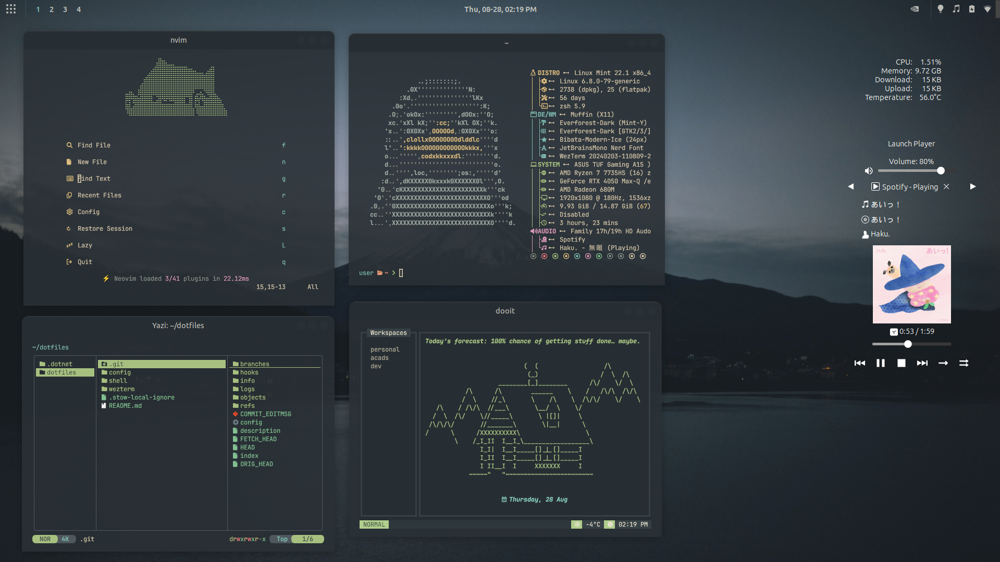

# Dotfiles

My personal configuration files managed with [GNU Stow](https://www.gnu.org/software/stow/).

## 🛠️ Tools

**Shell:** Bash, Zsh

**Terminal Emulator:** WezTerm, Kitty

**TUIs:** Calcure, Dooit, Yazi

**Others:** Neovim, Fastfetch, Pet, Starship

## 🎨 Features

- Everforest  Theme

## Screenshots



## Structure

This repository is organized into packages, each containing related configuration files:

- **shell/** - Shell configuration (bash, zsh, aliases, fzf)
- **wezterm/** - WezTerm terminal emulator configuration
- **config/** - Application configurations stored in ~/.config/

## Usage

### Install all packages
```bash
stow */
```

### Install specific packages
```bash
stow shell
stow wezterm
stow config
```

### Uninstall packages
```bash
stow -D shell
stow -D wezterm
stow -D config
```

### Uninstall all packages
```bash
stow -D */
```

## Requirements

- [GNU Stow](https://www.gnu.org/software/stow/)

Install on Ubuntu/Debian:
```bash
sudo apt install stow
```